# reTerminal Sticky Bunny

<p align="center">
  <strong>A living virtual pet and an interactive ePaper app collection for reTerminal Sticky.</strong>
</p>

<p align="center">
  <a href="README_CN.md">简体中文</a> ·
  <a href="README_JA.md">日本語</a> ·
  <a href="https://www.seeedstudio.com/sticky/">Sticky official site</a> ·
  <a href="https://www.seeedstudio.com/reTerminal-Sticky-p-6861.html">Product page</a> ·
  <a href="#quick-start">Get started</a> ·
  <a href="#complete-visual-tour">Visual tour</a> ·
  <a href="CHANGELOG.md">Changelog</a>
</p>

<p align="center">
  
  
  
  
  
  <a href="https://github.com/limengdu/reTerminal_Sticky_Bunny/actions/workflows/build.yml"></a>
</p>

<p align="center">
  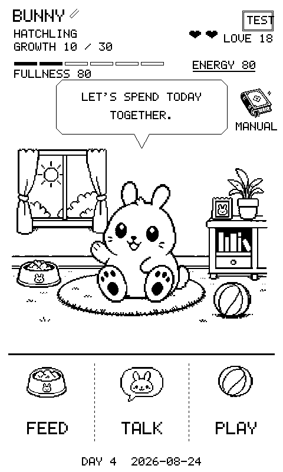
  &nbsp;&nbsp;
  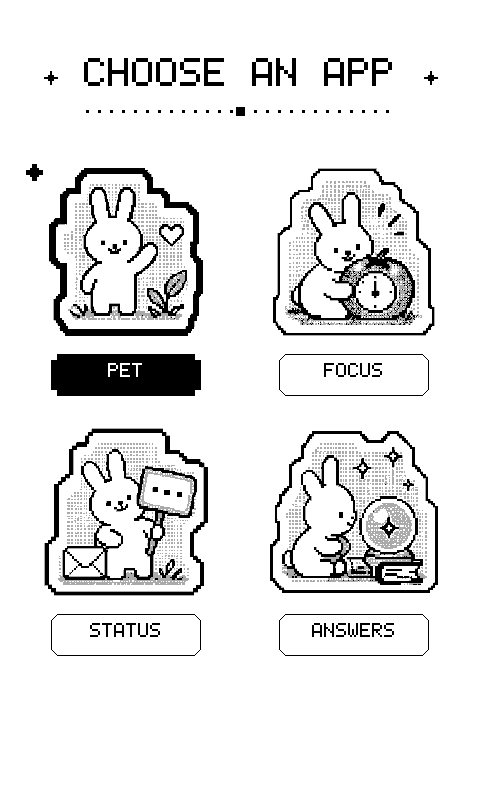
</p>

reTerminal Sticky Bunny turns the Seeed Studio **reTerminal Sticky** into a small, persistent world: raise a rabbit that remembers your care, start a Pomodoro session, show your availability, follow a pregnancy timeline, or ask the Book of Answers. Touch, buttons, swipe gestures, device rotation, continuous shaking, RTC scheduling, and low-power ePaper behavior are designed as one coherent firmware experience.

Learn more about the device on the [Sticky official website](https://www.seeedstudio.com/sticky/) and the [reTerminal Sticky product page](https://www.seeedstudio.com/reTerminal-Sticky-p-6861.html).

This repository contains the complete PlatformIO/ESP-IDF firmware, original monochrome artwork, host-side behavior and rendering tests, release packaging, and developer documentation.

## Why this project is different

- **A pet with continuity, not a static mascot.** It hatches, grows through five life stages, develops one of three personalities, remembers care, sleeps, speaks, plays, and occasionally goes outside.
- **Five polished on-device experiences.** The desktop pet, Pomodoro timer, status board, pregnancy tracker, and Book of Answers share one launcher and one visual language.
- **The device itself is the controller.** Open the launcher by button or swipe, select by touch, rotate into portrait or landscape apps, and shake to enter the Book of Answers.
- **Designed for ePaper.** Stable screens use full or quality refreshes; time-sensitive views use bounded partial updates; input remains responsive while a refresh is in flight.
- **Built around real hardware behavior.** The firmware manages the shared display/SD SPI bus, GT911 touch controller with the verified Sticky `480 x 800` sensor mapping and reference reset recovery, LSM6DS3TR-C IMU, PCF8563 RTC, BQ27220 fuel gauge, buzzer, side buttons, battery operation, and deep sleep.

## Application gallery

| Virtual pet | Pomodoro timer |
| --- | --- |
|  | 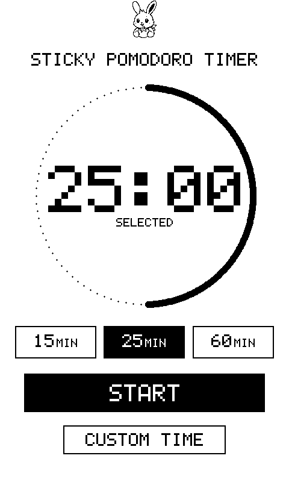 |
| Hatch, name, feed, pet, talk to and play with a rabbit whose stage, personality and dialogue change over time. | Pick 15, 25 or 60 minutes, enter a custom duration, pause or end a session, and receive a gentle repeating alarm. |

| Status board | Book of Answers |
| --- | --- |
| 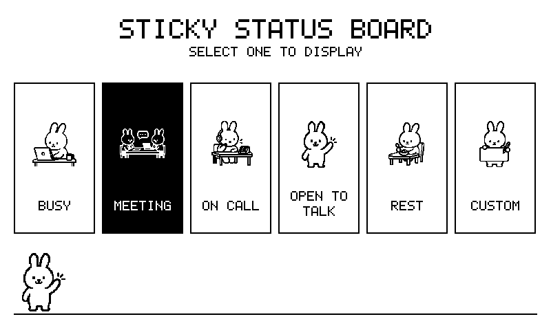 | 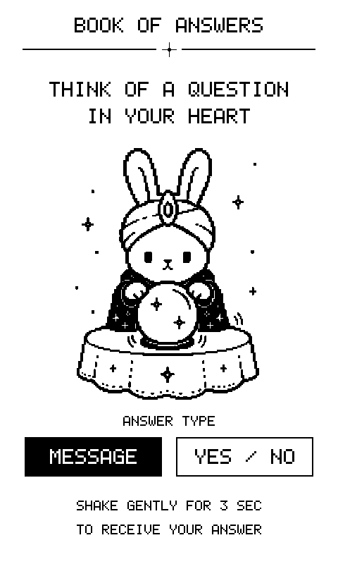 |
| Display `BUSY`, `MEETING`, `ON CALL`, `OPEN TO TALK`, `REST`, or a custom on-device message in landscape. | Hold a question in mind and shake for three seconds to reveal a message, `YES`, `NO`, or `UNCLEAR`. |

| Pregnancy tracker |
| --- |
| 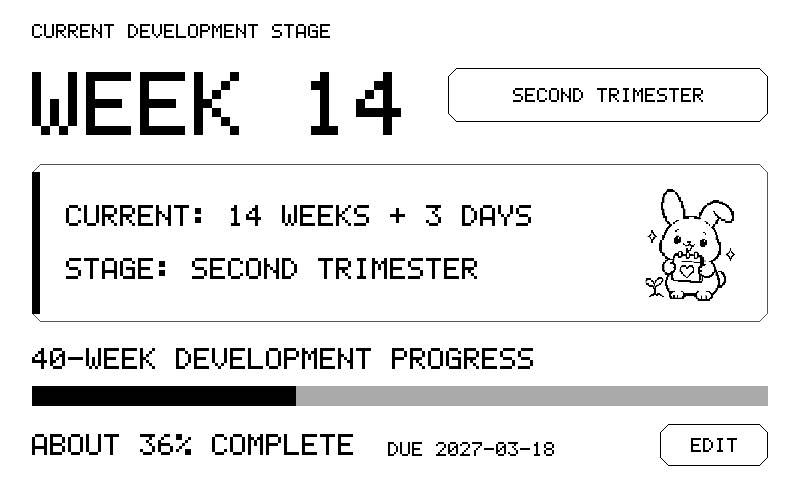 |
| On first use, confirm the device clock and enter the due date. The RTC then drives the current week, trimester, completion percentage, and days remaining automatically. |

## The virtual pet

The pet is the home screen and the emotional center of the firmware. Its state is advanced by real RTC time and stored in two checksummed NVS slots so a damaged save can fall back to the previous valid record.

<p align="center">
  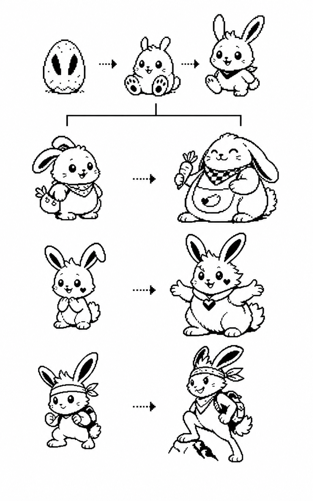
</p>

### Life and personality

1. **Egg** — three deliberate taps hatch the pet.
2. **Hatchling** — care establishes the first bond.
3. **Child** — feeding, affection and play begin shaping personality evidence.
4. **Youth** — the rabbit becomes `FOODIE`, `AFFECTIONATE`, or `ACTIVE`.
5. **Adult** — each branch receives its own proportions, actions, dialogue and keepsake.

Growth, love, fullness, energy, daily care streaks, mood, recent actions, recent dialogue, personality evidence and scheduled outings persist across restarts. The balancing model and audited upstream inspirations are documented in [the pet growth design](docs/desktop_pet_growth_system.md).

| Value | What it means |
| --- | --- |
| `GROWTH` | Long-term progress earned through valid daily care |
| `LOVE` | Bond level that changes dialogue and reactions |
| `FULLNESS` | Hunger state restored by feeding |
| `ENERGY` | Activity capacity restored at 6% per sleeping minute |

Care is deliberately paced. Each day can award up to 10 growth and 8 love; milestone celebrations happen once at 3, 7, 30, and 100 consecutive care days. The rabbit can leave home on some days, remains away for a scheduled 1–7 hours, and can be called back from the outing page.

## Launcher and physical interaction

<p align="center">
  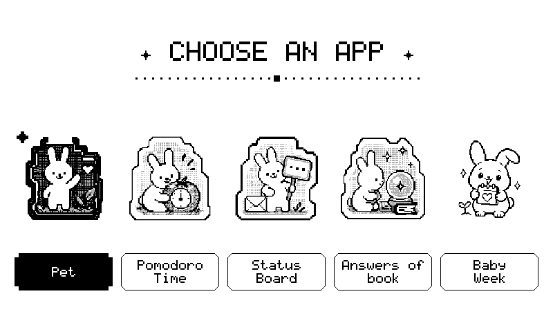
</p>

- Tap the **AI key** or swipe up from the lower screen to open the launcher.
- Tap an app card to launch it.
- Swipe down from the upper half to close the launcher.
- Double-tap the AI key from any page to return to the pet.
- Rotate from landscape to portrait while the launcher is open to enter Pomodoro.
- Rotate from portrait to landscape while the launcher is open to enter the Status Board.
- Shake while the launcher is open to enter the Book of Answers.
- Hold both non-AI side keys to enter deep sleep.

Orientation is accepted only after motion settles and the final placement is stable. Five stable samples qualify a rotation; a continuous 800 ms launcher shake selects the Book of Answers, whose own question flow requires three seconds of effective shaking.

## ePaper, power and time

The display keeps its last image without power, so the firmware treats every refresh as a limited resource. Static pages receive a clean baseline; countdown digits and animation regions use smaller refresh policies; periodic full refreshes restore contrast.

The pet schedules its next meaningful event before sleep. The PCF8563 RTC can wake the ESP32-S3 shortly before an outing or another autonomous event instead of waking at a fixed interval. Battery percentage comes from the BQ27220 fuel gauge, and the UI keeps charging and sleep indicators visible without covering app content.

Deep sleep can also be requested by holding the two non-AI side keys. Before sleeping, the active app saves a stable page, input peripherals stop safely, the display is cleaned when required, and the RTC receives the next meaningful wake time.

## Complete visual tour

Every screen below is either rendered from the firmware's real `Canvas` and one-bit assets or retained as clearly labeled design history. These are the same layouts and assets used by the device build.

### Desktop pet: from egg to an individual companion

| Egg and home | Child and youth |
| --- | --- |
| 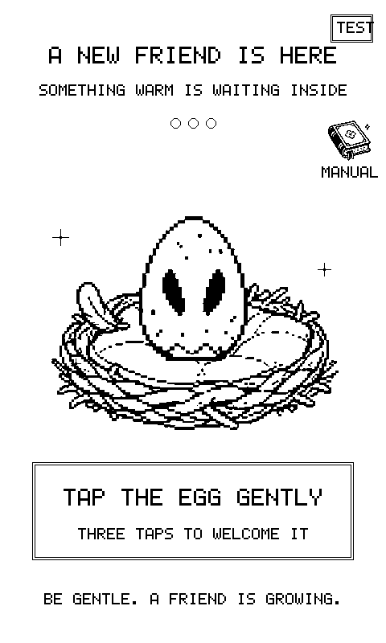 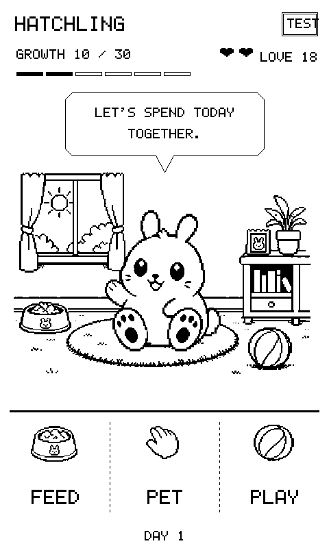 | 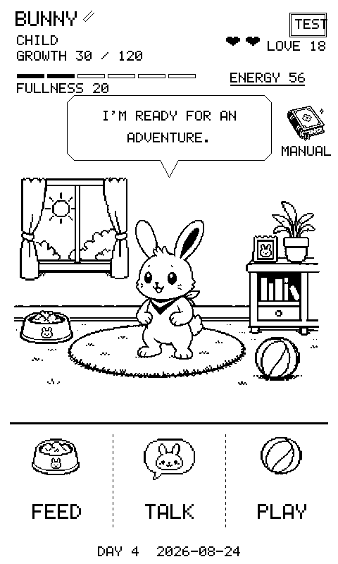 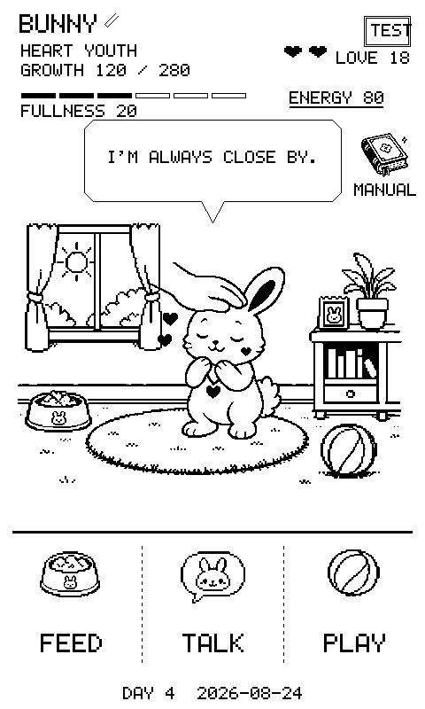 |

| Personality and adulthood | Sleep and outings |
| --- | --- |
| 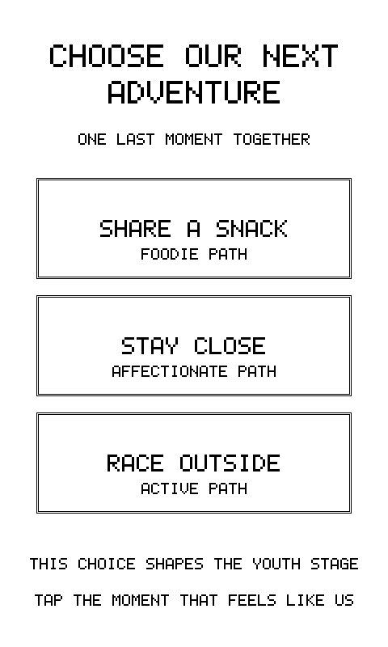 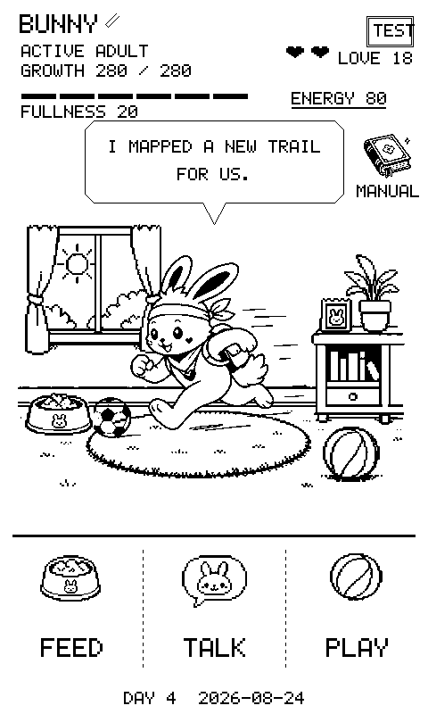 | 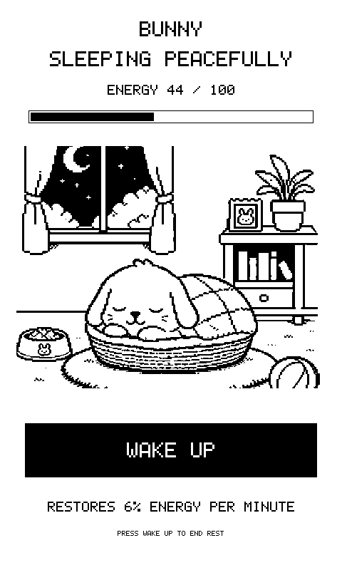 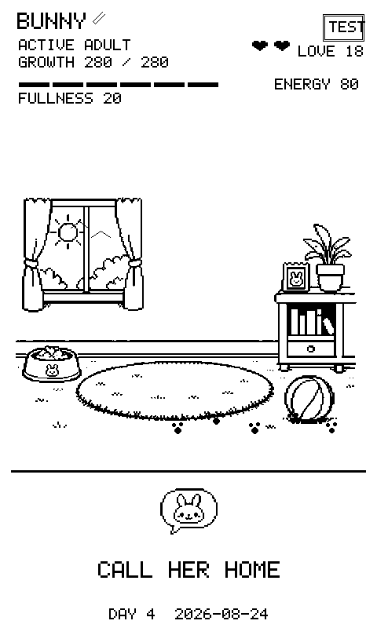 |

The pet model is independent from the display code. RTC time advances needs and age, interactions update a versioned state object, two checksummed NVS slots protect saves, and the UI chooses a stage- and personality-specific pose. Dialogue selection filters by stage, bond, activity, and recent history so another valid sentence is preferred over an immediate repeat.

### Pomodoro: setup, focus, and finish

<p align="center">
  
  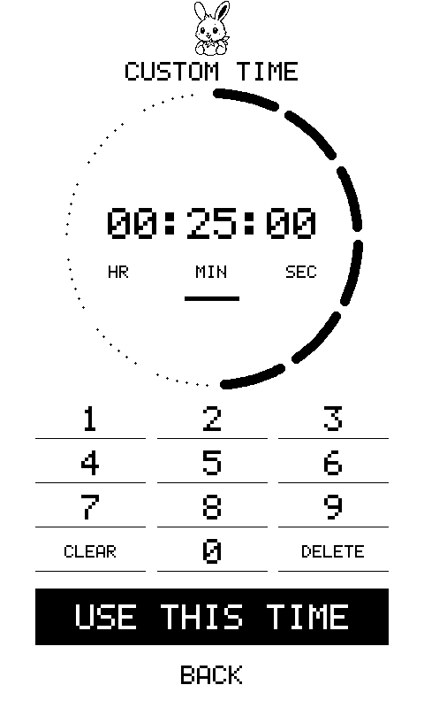
  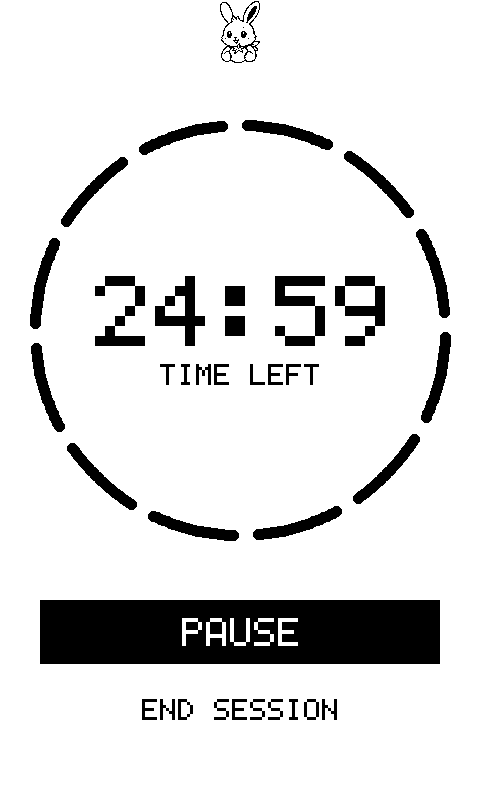
  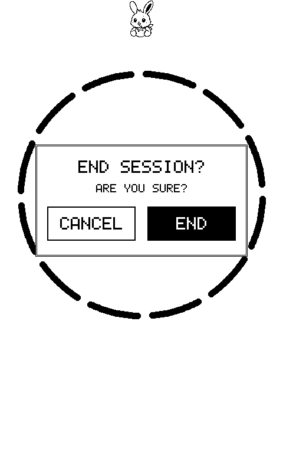
  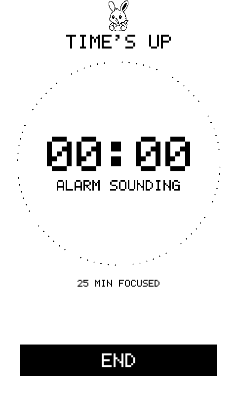
</p>

The home page keeps only the three practical presets: 15, 25, and 60 minutes. Custom input supports separate hour, minute, and second fields; `CLEAR` resets the active field, while `DELETE` behaves as backspace. The countdown uses real elapsed time, keeps touch responsive during refresh, supports pause and an in-place end confirmation, and repeats a gentle alarm until `END` is tapped.

### Status Board: one glance, one clear state

| Menu | Full status |
| --- | --- |
|  |  |

| Open to talk | On-device custom text |
| --- | --- |
|  | 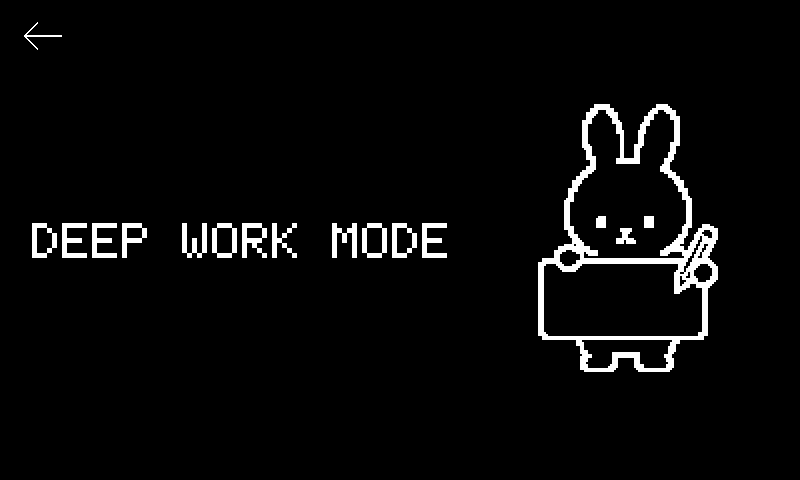 |

`BUSY`, `MEETING`, `ON CALL`, `OPEN TO TALK`, `REST`, and `CUSTOM` each open a full landscape second-level page. Preset pages use a matching rabbit scene; the custom page provides a responsive letters/numbers keyboard and stores the selected text for the current session.

### Pregnancy tracker: set it once, then follow each day

<p align="center">
  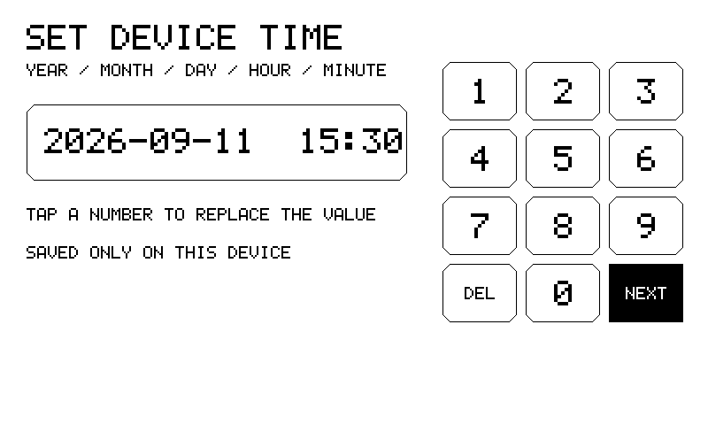
  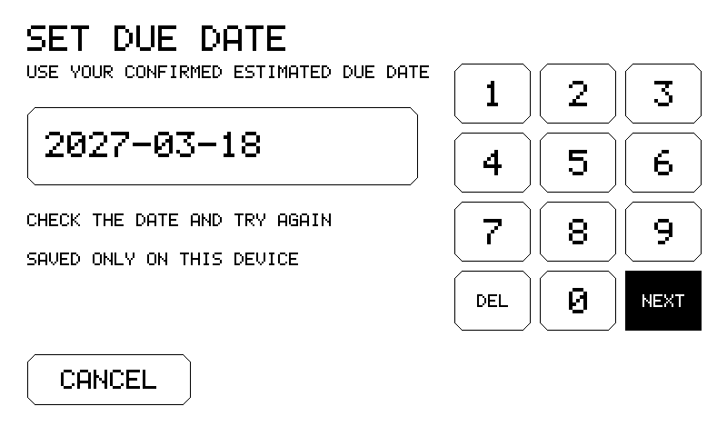
  
</p>

The first launch is a two-step setup: confirm or enter the device date and time, then enter the due date. A validated configuration is stored in NVS, so later launches open directly to the landscape dashboard. The RTC drives the current week and day, trimester, 40-week progress, and days remaining; the page refreshes after midnight and `EDIT` reopens setup at any time.

### Book of Answers: ask, shake, think, reveal

<p align="center">
  
  
  
  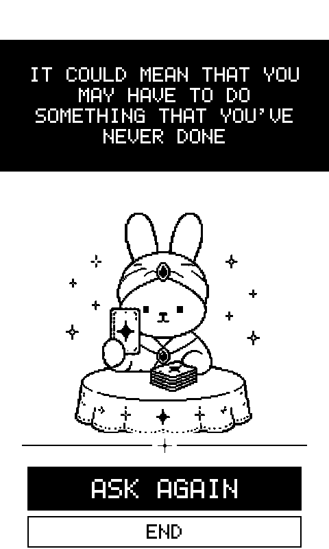
  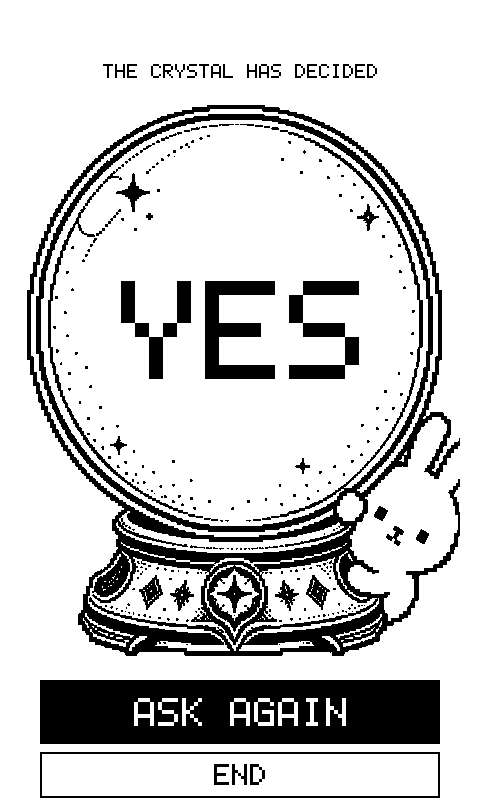
</p>

`MESSAGE` is selected by default and draws from 350 embedded answers. `YES OR NO` uses the crystal ball and returns `YES`, `NO`, or `UNCLEAR`. The home page stays visually quiet so the three-second instruction remains easy to read. A short shake opens an exact retry message; a qualified shake continues through thinking and reveal animations before showing the result.

### Launcher in both physical orientations

| Portrait layout | Landscape layout |
| --- | --- |
|  |  |

The launcher starts IMU monitoring as soon as the AI key is physically pressed, before the ePaper refresh begins. Touch selection and motion selection remain available together. The selected app receives the device's final placement so both drawing and touch coordinates use the same visible direction.

### Six-page first-boot guide

The guide appears once for a new NVS state and can be reopened from the illustrated book on the pet home screen.

| Welcome | Care values | Growth results |
| --- | --- | --- |
| 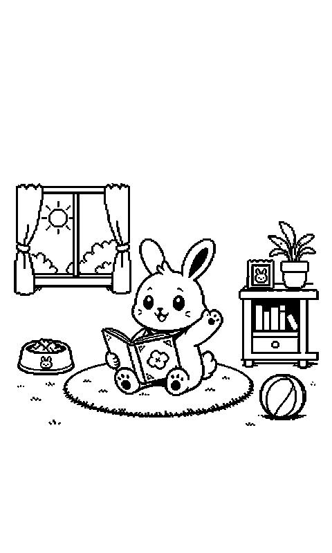 | 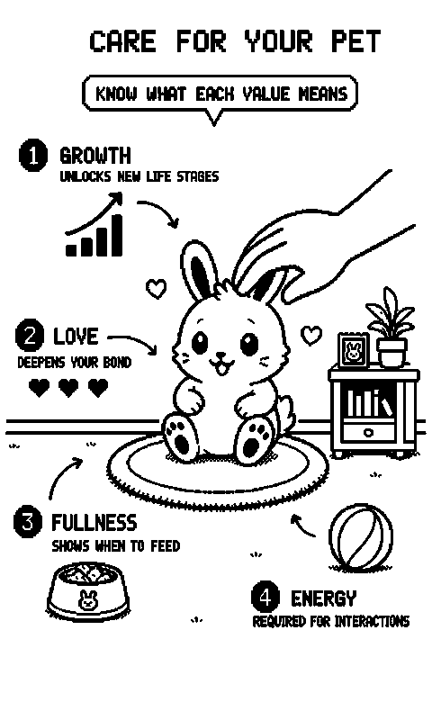 | 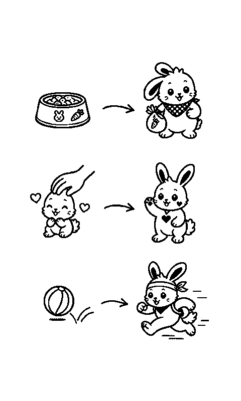 |

| Applications | Launcher controls | Rotation and shake |
| --- | --- | --- |
| 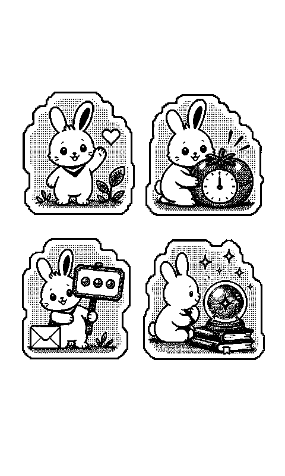 | 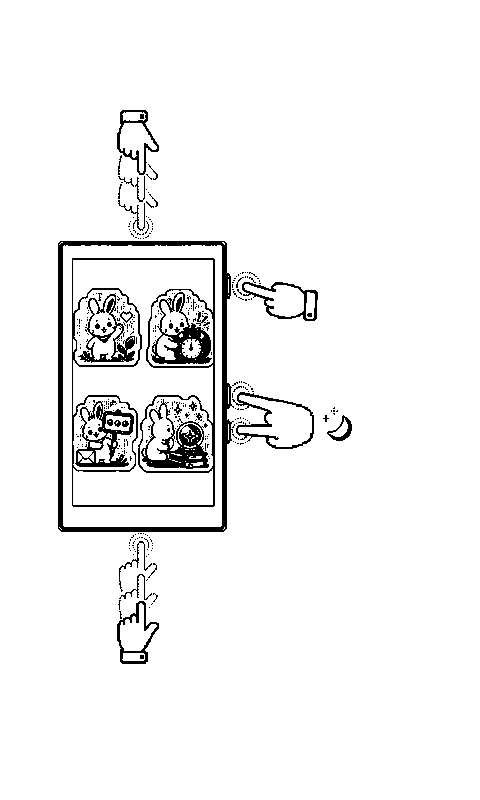 | 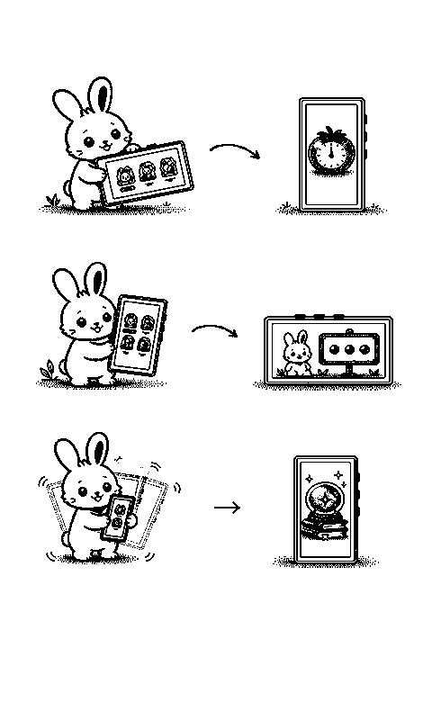 |

## Hardware target

| Component | Firmware use |
| --- | --- |
| ESP32-S3R8 | Application, graphics, input routing and low-power control |
| 800 × 480 monochrome ePaper | Portrait and landscape application UI |
| GT911 | Capacitive touch and swipe input |
| LSM6DS3TR-C | Stable orientation, motion sessions and continuous shake detection |
| PCF8563 | Calendar time and scheduled wake-up |
| BQ27220 | Battery state of charge |
| Buzzer | Context-aware pet sounds and Pomodoro alarm |
| MicroSD slot | Shared SPI hardware path prepared safely at boot |

The implementation follows the board initialization and driver behavior demonstrated by Seeed Studio's Sticky hardware examples.

## Quick start

### Requirements

- reTerminal Sticky
- USB-C data cable
- PlatformIO Core 6.1 or PlatformIO IDE
- Python 3
- macOS, Linux, or Windows

The project pins `espressif32@6.11.0` and builds against ESP-IDF 5.4.1.

### Clone and build

```bash
git clone https://github.com/limengdu/reTerminal_Sticky_Bunny.git
cd reTerminal_Sticky_Bunny
pio run
```

`sticky-release` is the default environment. A successful build creates:

```text
.pio/build/sticky-release/firmware.bin
```

### Upload the release firmware

```bash
pio run -e sticky-release -t upload
```

For development logs:

```bash
pio run -e sticky-debug -t upload
pio device monitor -e sticky-debug
```

The monitor runs at `115200` baud. A successful boot reaches `sticky_boot: phase=ready result=ok` and then reports the active app. To start from a completely new pet and replay onboarding, erase the flash and upload again:

```bash
pio run -e sticky-release -t erase
pio run -e sticky-release -t upload
```

## Build profiles

| Environment | Purpose | Runtime rules | Logging |
| --- | --- | --- | --- |
| `sticky-release` | Daily use and releases | Production time, limits and outing schedule | Essential warnings and lifecycle events |
| `sticky-debug` | Hardware and interaction diagnosis | Production gameplay rules | Detailed app, input and storage logs |
| `sticky-power-test` | Accelerated sleep/wake validation | Shortened power timing only | Power-focused diagnostics |

Build every profile before a release:

```bash
pio run -e sticky-release -e sticky-debug -e sticky-power-test
```

## Repository map

```text
src/
├── app/                 # App manager, launcher, routing and lifecycle
├── apps/                # Pet, Pomodoro, Status Board, Answers and onboarding
├── board/               # Power, charger, shared buses and pin configuration
├── devices/             # Battery, RTC and buzzer drivers
├── display/             # ePaper ownership and refresh operations
├── input/               # Buttons and GT911 touch queue
├── sensors/             # IMU orientation and shake sessions
└── ui/                  # Canvas, font, overlays and generated pixel assets

assets/                  # Original art, firmware-ready images and QA renders
docs/images/             # Curated README screenshots and design history
docs/desktop_pet_growth_system.md
                         # Detailed pet rules and source audit
test/                    # Native state, policy and rendering tests
tools/                   # Deterministic asset and database generators
third_party/             # License notices for adapted open-source ideas
```

### Firmware execution flow

1. `app_main()` holds the battery-power latch and initializes the board power paths.
2. Shared SPI and I²C owners start before display, touch, RTC, battery, buzzer, buttons, and IMU clients.
3. New devices enter the six-page tutorial; completed devices restore the pet save and open the correct root page.
4. The app coordinator gives exactly one app input and display ownership at a time.
5. The launcher pauses the active app, captures touch and IMU choices, then resumes or switches ownership.
6. Before deep sleep, stable state is saved, peripherals stop, the display is prepared, and the RTC alarm is programmed.

Public hardware and app interfaces use concise bilingual comments. Pure C++ state, policy, routing, storage-record, and rendering modules remain independent from ESP-IDF wherever possible so behavior can be verified on a development computer.

## Tests and visual QA

The native tests exercise state machines and render pages into PPM files without requiring the device. Coverage includes:

- pet progression, offline time, dialogue, animation scheduling and dual-slot saves;
- Pomodoro input, countdown policy, page layout and alarm states;
- status selection, custom text and status-specific animation;
- answer selection, three-second shake qualification and result layouts;
- launcher touch zones, swipe gestures, orientation routing and power policy;
- onboarding navigation and all six final pages.

```bash
./tools/run_host_tests.sh
python3 tools/check_markdown_links.py
```

Rendering tests write PPM previews to `/tmp`, including pet, Pomodoro, Status Board, pregnancy tracker, Book of Answers, launcher, and all onboarding pages. These previews use the firmware's actual canvas, font, touch maps, and generated pixel assets.

### Asset regeneration

```bash
python3 -m pip install -r requirements-dev.txt
python3 tools/generate_desktop_pet_assets.py
python3 tools/generate_pomodoro_assets.py
python3 tools/generate_app_launcher_assets.py
python3 tools/generate_book_of_answers_assets.py
python3 tools/generate_onboarding_assets.py
python3 tools/generate_pixel_bunnies.py
```

Generated C++ assets are written under `src/ui/assets/`. Re-running the generators with unchanged inputs produces no source diff.

## Hardware and driver map

<p align="center">
  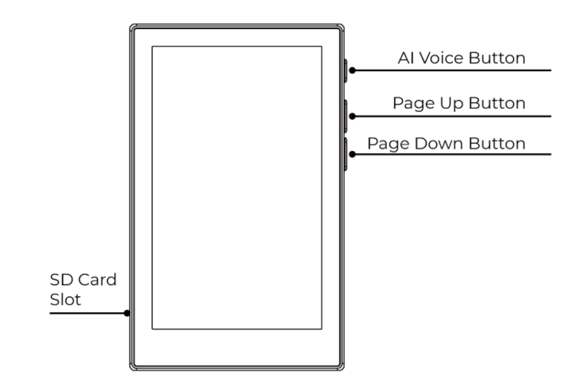
</p>

| Hardware path | Firmware owner |
| --- | --- |
| ePaper and microSD shared SPI | `src/board/board_shared_spi.*` serializes display and SD ownership |
| GT911 at `0x14` | `src/input/sticky_touch.*` records released taps and complete swipe paths |
| LSM6DS3TR-C at `0x6A` | `src/sensors/sticky_imu.*` reports observed motion, stable placement, and shake sessions |
| PCF8563 at `0x51` | `src/devices/sticky_rtc.*` supplies date, elapsed time, and alarm wake |
| BQ27220 at `0x55` | `src/devices/sticky_battery.*` supplies charge percentage |
| GPIO 48 buzzer | `src/devices/sticky_buzzer.*` plays non-blocking app and pet patterns |

## Troubleshooting

| Symptom | Check |
| --- | --- |
| Upload cannot connect | Use a data-capable cable, close the serial monitor, select the current `/dev/cu.*` or COM port, then retry upload. |
| Old pet values remain | Run the erase and upload commands above; uploading alone preserves NVS by design. |
| Display works but touch does not | Use `sticky-debug` and confirm `GT911` reports ID `911`, address `0x14`, sensor `480x800`, and `touch=polling_ready`. |
| Screen contains an old ghost image | Confirm boot performs a white full clear and that periodic cleanup refreshes still occur. |
| Rotation selects the wrong page | Compare the settled `from` and `to` orientation log with the device's physical final placement. |
| Short shake immediately reveals an answer | Confirm a fresh quiet gate is armed and effective peaks span the complete three-second question window. |
| Battery operation stops after USB removal | Confirm the boot log reports the power latch and charger path before display initialization. |

## Design history

The project grew through physical-device testing and repeated ePaper UI studies. The current code-rendered screens above are the shipped source of truth; the selected concepts below show how the rabbit, launcher, tutorial, and focus language developed.

<details>
<summary><strong>Open the design and asset gallery</strong></summary>

### Desktop pet home direction

<p align="center">
  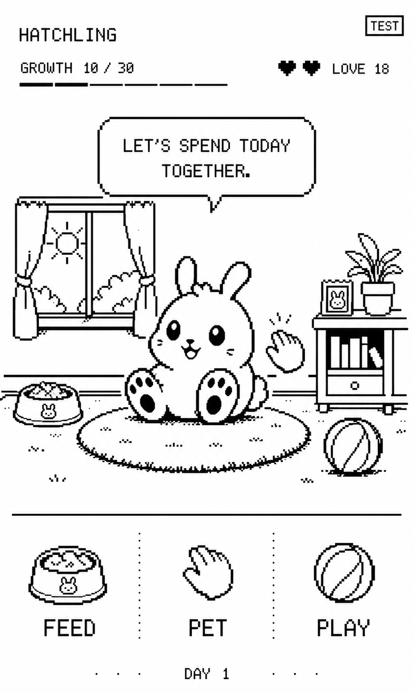
  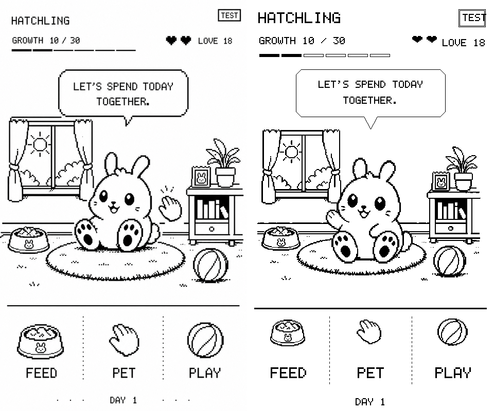
</p>

### App launcher direction

<p align="center">
  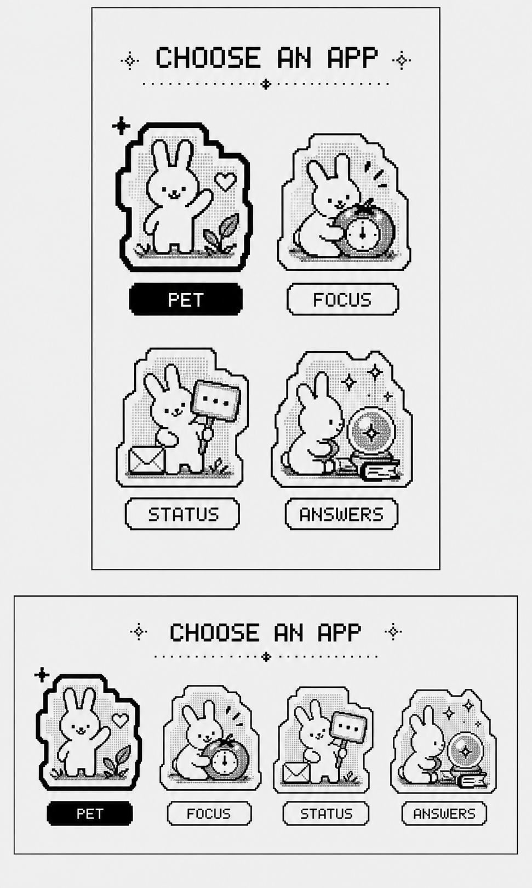
</p>

### First-boot tutorial direction

<p align="center">
  
</p>

### Pomodoro guidance direction

<p align="center">
  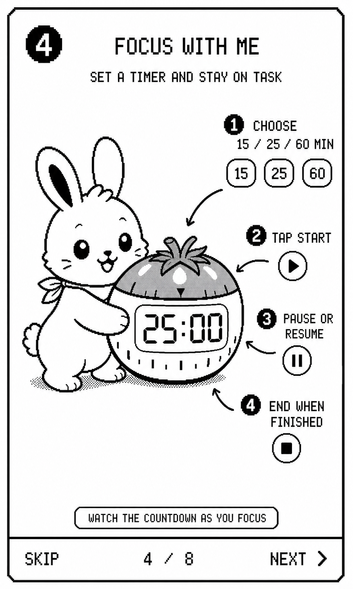
</p>

</details>

## Contributing

Issues and pull requests are welcome. Start with [CONTRIBUTING.md](CONTRIBUTING.md), keep hardware behavior traceable to the Sticky reference implementation, add a native regression test for behavior changes, and include a device validation plan when hardware is required.

## Credits and licenses

Sticky Bunny is released under the [MIT License](LICENSE).

The pet architecture adapts small MIT-licensed ideas from TamaPoke, esp32-artoria-tamagotchi, openclaw-tamagotchi and ESP32-TamaPetchi. The original notices and exact audited commits are recorded in [third_party/virtual_pet/NOTICE.md](third_party/virtual_pet/NOTICE.md). Rabbit artwork in this repository is original to this project.

The Book of Answers message database is derived from `DBinK/The-Book-of-Answers-Interpreter` under the Apache License 2.0; its complete notice is stored with the source database.

reTerminal Sticky is a product of Seeed Studio. This is a community firmware project and is not presented as the device's factory firmware.
