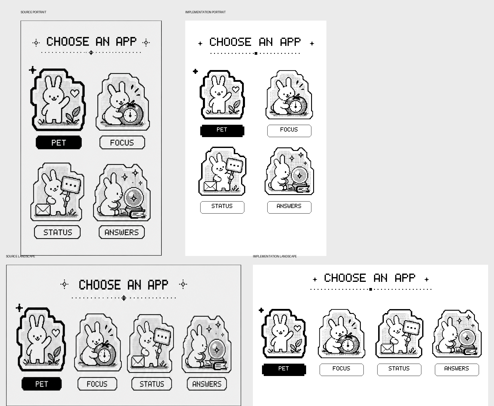
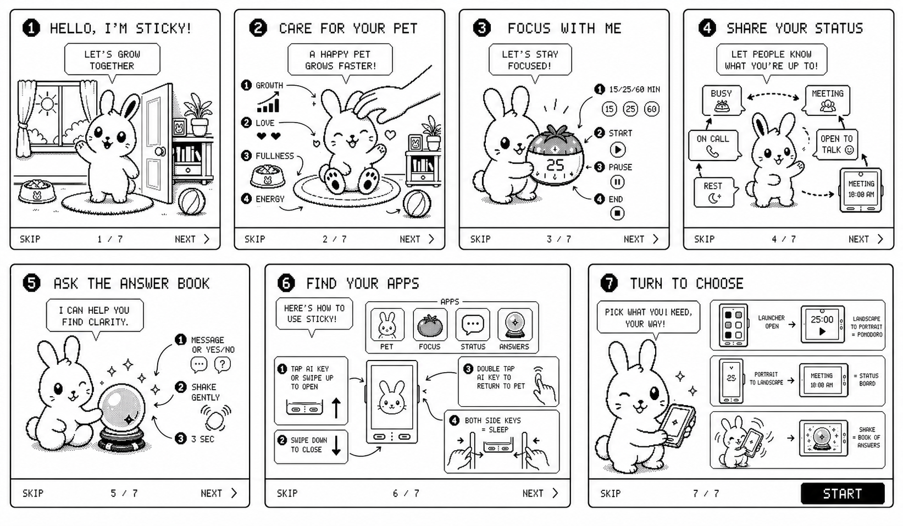

# Design and Asset Gallery

This page preserves selected concept work that materially influenced the shipped firmware. Concept images explain intent; code-rendered images elsewhere in the Wiki are the source of truth for current behavior.

## Desktop pet home

The home concept established the room, rug, care actions and top-level growth values. The implementation later tightened spacing, moved petting to the rabbit body, added talk, energy recovery, date and battery/sleep overlays, and created stage-specific artwork.

  

  

## App launcher

The launcher concept introduced four sticker-like app illustrations and a responsive portrait/landscape layout. Final firmware retains that identity while applying exact touch targets, selected outlines and centered spacing.

  

  

## First-boot tutorial

The original tutorial board explored pet care, application summaries, launcher controls and motion selection as one visual story. The final firmware uses six individually redrawn pages with a consistent device outline, button placement, footer and rabbit proportions.

  

  

## Pomodoro guidance

The Pomodoro guide concept defined the tomato-rabbit relationship and the four key actions: choose, start, pause and end. The production app translates those instructions into a simpler timer-first interface.

  

## Original rabbit library

The project contains original monochrome poses for life stages, personality branches, feeding, petting, playing, sleeping, talking, status display, the answer ritual and launcher stickers. Source artwork lives under `assets/`; normalized firmware frames and generated arrays remain separate so future edits are reproducible.
